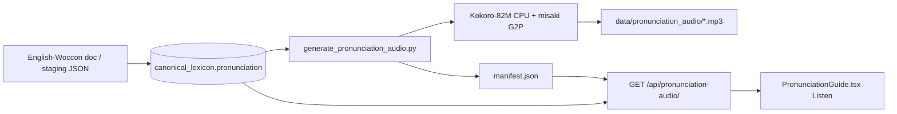

# Pronunciation audio (Kokoro batch TTS)

Pre-generated MP3 clips for **English-Woccon community pronunciation guides**. The control panel **Listen** button plays Kokoro audio when a clip exists; otherwise it falls back to browser `speechSynthesis`.

**Status (Aug 2026):** R6-b implemented — ~250 clips from staging/DB guides, served at `/api/pronunciation-audio/{filename}`.

---

## Architecture



| Layer | Role |
|-------|------|
| **Ingest** | `English-Woccon.json` / base-vocab sync merges `pronunciation` onto **base** lexicon rows |
| **Phonemes** | `panel_api/services/kokoro_phonemes.py` — syllable G2P + **CAPS = stress** (avoids spelling acronyms) |
| **Filter** | `is_speakable_pronunciation()` — skips citations, grammar notes, English glosses |
| **Batch** | `scripts/generate_pronunciation_audio.py` — Kokoro synth, human-readable filenames, manifest |
| **Serve** | `panel_api/routes/pronunciation_audio.py` — static MP3 + JWT not required |
| **Panel** | `pronunciation_audio_url` on lexicon API; `PronunciationGuide` plays MP3 or browser fallback |

---

## Quick start

### 1. TTS runtime (isolated venv — do not mix with main `.venv`)

```bash
python3.12 -m venv .venv-tts
source .venv-tts/bin/activate
pip install -r requirements-tts.txt
# macOS: brew install espeak-ng ffmpeg
```

### 2. Generate clips

From **panel DB** (default):

```bash
HF_HOME=data/hf_cache .venv-tts/bin/python scripts/generate_pronunciation_audio.py
```

From **staging JSON** (matches English-Woccon ingest):

```bash
HF_HOME=data/hf_cache .venv-tts/bin/python scripts/generate_pronunciation_audio.py \
  --staging woccon_language/drive_staging/English-Woccon.json
```

Regenerate everything (drops stale MP3s):

```bash
HF_HOME=data/hf_cache .venv-tts/bin/python scripts/generate_pronunciation_audio.py \
  --force --staging woccon_language/drive_staging/English-Woccon.json
```

QA sample (~20 hard CAPS/stress cases):

```bash
HF_HOME=data/hf_cache .venv-tts/bin/python scripts/generate_pronunciation_audio.py --sample-only
```

Dry run (no synth):

```bash
.venv-tts/bin/python scripts/generate_pronunciation_audio.py --dry-run --staging woccon_language/drive_staging/English-Woccon.json
```

### 3. Panel dev

```bash
# Port 8000 is often taken (e.g. Caddy). Use 8003 locally:
PORT=8003 LOCAL_LLM=false ./run-panel-dev.sh
# Panel: http://localhost:5173/panel/login
# Backend: http://127.0.0.1:8003
```

Vite proxies `/api` to `WOCCON_BACKEND_PORT` or `PORT` (see `panel/vite.config.ts`).

**Restart backend** after changing `pronunciation_audio.py` / `kokoro_phonemes.py` — there is no hot reload for those modules.

Stop stale dev processes:

```bash
./run-panel-dev.sh --stop
```

### 4. Listen locally

```bash
open data/pronunciation_audio
afplay "data/pronunciation_audio/roosome - Acorns (rue-sa-may).mp3"
```

---

## Environment variables

| Variable | Default | Purpose |
|----------|---------|---------|
| `PRONUNCIATION_AUDIO_DIR` | `data/pronunciation_audio` | MP3 output + `manifest.json` |
| `KOKORO_VOICE` | `af_heart` | Kokoro voice id |
| `KOKORO_SPEED` | `0.8` | Speech rate |
| `KOKORO_LANG_CODE` | `a` | Kokoro pipeline lang (`a` = American English) |
| `HF_HOME` | — | Hugging Face cache (set to `data/hf_cache` to keep models in-repo dir) |
| `WOCCON_PRONUNCIATION_DRIVE_ID` | — | Google Doc id for English-Woccon (ingest / base-vocab merge) |
| `PORT` / `WOCCON_BACKEND_PORT` | `8000` / same | Backend port; Vite proxy target |

See `.env.example` for copy-paste blocks.

---

## Output layout

**Filenames** (human-readable, not content hashes):

```text
roosome - Acorns (rue-sa-may).mp3
tau-unta-winnik - Axe (ta-oo-oon-ta-we-neek).mp3
week - Shot (way-ayk).mp3
```

**Manifest** (`data/pronunciation_audio/manifest.json`):

- Keyed by SHA1 of normalized guide text
- Stores `filename`, `kokoro_text`, `woccon_ids`, `lexicon_rows`, voice/speed

**API lookup:** `pronunciation_audio_url(guide)` → `/api/pronunciation-audio/{url-encoded-filename}` only if:

1. Guide passes `is_speakable_pronunciation()`
2. Manifest entry exists
3. MP3 file is on disk

---

## CAPS = stress (critical)

Community guides use **CAPS for stressed syllables** (English-Woccon convention).

Kokoro/misaki treats ALL-CAPS tokens as **letter-by-letter acronyms** (`CHOO` → C-H-O-O). Fix in `kokoro_phonemes.py`:

1. Split guide on hyphens/spaces into syllable chunks
2. Lowercase each chunk for misaki G2P
3. Insert IPA primary stress `ˈ` before the vowel in CAPS chunks
4. Send Kokoro markdown override: `[RUE-chay-ha](/ɹˈu ʧA hɑ/)`

**Do not** remove this pipeline without re-testing `RUE-chay-ha`, `CHOO`, `WAWN`, etc.

---

## Speakability filter

`is_speakable_pronunciation()` in `panel_api/services/pronunciation_audio.py` decides what gets batch-generated and what gets a `pronunciation_audio_url`.

| Rejected | Example | Why |
|----------|---------|-----|
| Grammar / meta | `mo= good and ne= questioning mode marker` | Not a syllable guide |
| Citations | `[Carter, 173]`, `[Rudes(2000), 240]` | Bibliography, not phonetics |
| English glosses | `little man`, `wind blowing angry` | Meaning explanation from source line |
| Empty / no letters | — | Nothing to speak |

| **Allowed** | Example | Notes |
|-------------|---------|-------|
| Hyphenated guides | `rue-sa-may`, `ta-oo oon-ta we-neek` | Normal case |
| Space-separated respellings | `way ayk` | Allowed when not all common English words |
| Single syllable | `hay`, `wee` | Short clips; may sound brief |

To block a new gloss pattern, add words to `_COMMON_GLOSS_WORDS` (all words in phrase must match to reject).

---

## Panel behavior

- **Base entry** rows carry pronunciation from vocab sync; **variant** rows often have `pronunciation: null` — Listen on the **base** card (`is_base_entry=true`).
- `GET /api/lexicon/base`, `/api/lexicon`, grouped views attach `pronunciation_audio_url` via `panel_api/services/serializers.py`.
- `PronunciationGuide.tsx`: MP3 if URL present; on play error → browser TTS fallback.
- Attestation expander shows alternate spelling pronunciation only when that variant row has its own guide.

---

## Key files

| Path | Purpose |
|------|---------|
| `scripts/generate_pronunciation_audio.py` | Batch generator CLI |
| `panel_api/services/kokoro_phonemes.py` | CAPS stress + misaki G2P → Kokoro IPA |
| `panel_api/services/pronunciation_audio.py` | Hash, manifest, speakability, URLs, filenames |
| `panel_api/routes/pronunciation_audio.py` | `GET /api/pronunciation-audio/{filename}` |
| `panel_api/services/serializers.py` | Adds `pronunciation_audio_url` to lexicon responses |
| `panel/src/components/PronunciationGuide.tsx` | Listen UI |
| `requirements-tts.txt` | Kokoro/misaki deps (Python 3.10–3.12) |
| `scripts/test_pronunciation_audio.py` | Speakability, filenames, hashes |
| `scripts/test_kokoro_phonemes.py` | Syllable split + markdown override |

---

## Tests

```bash
python3 scripts/test_pronunciation_audio.py
.venv-tts/bin/python scripts/test_kokoro_phonemes.py
```

Run speakability tests after any filter change.

---

## Troubleshooting

| Symptom | Likely cause | Fix |
|---------|--------------|-----|
| Listen uses browser voice | No MP3 / URL null | Check base row has `pronunciation`; run generator; verify speakability |
| Login / panel broken | Backend down or wrong port | `PORT=8003 ./run-panel-dev.sh`; port 8000 often not Woccon |
| `way ayk` had no clip | Was blocked as multi-word gloss | Fixed — respellings with non-English tokens allowed |
| `[Carter, 173]` spoke "Carter" | Bad ingest pronunciation | Filter rejects; fix upstream staging row |
| `(little man)` on he-to | English gloss in parens | Filter rejects; needs real phonetic guide in doc |
| Clip sounds wrong | G2P limit | Prefer **light, per-guide** tweaks; see cautions below |
| New routes 404 | Stale backend | Restart `./run-panel-dev.sh` |

**Verify API:**

```bash
curl -sf http://127.0.0.1:8003/health
# After login, lexicon row should include pronunciation_audio_url when clip exists
```

---

## Guidance for future passes / agents

### What works

- Kokoro **af_heart** @ **0.8** speed on **CPU** (`.venv-tts`)
- Batch-only generation — not live on-demand TTS during panel use
- CAPS → IPA stress pipeline for community guides
- Speakability filters for ingest noise (citations, glosses)
- Human-readable MP3 filenames for debugging

### What **not** to do (regression lessons)

These were tried and **made quality worse across the board**:

- Spacing every phoneme character (`n u m` vs `num`) — choppy, robotic
- Global respelling vowel hacks (`ee`→`i`, etc.) — unpredictable side effects
- Aggressive leading-silence trim + fade on all clips — unnatural attacks
- Global speed/padding changes on all short syllables

**Prefer:** targeted fixes for individual guides, upstream staging/DB pronunciation cleanup, or panel-side playback polish — not global phoneme surgery.

### Suggested next steps (optional)

1. **Upstream:** Fix LLM/parser rows that store citations or glosses as `pronunciation`
2. **Merge:** Copy pronunciation from base entry to display when variant is null
3. **UIC cron:** Queue `generate_pronunciation_audio.py` when GPU/LLM idle (batch only)
4. **Quality:** Per-guide QA list in `--sample-only` before full `--force`
5. **R6-c+:** Export bundles / public dictionary with audio URLs

---

## Related docs

- [CONTROL_PANEL.md](CONTROL_PANEL.md) — panel dev, dictionary, base vocab + pronunciation merge
- [RECONSTRUCTION_ROADMAP.md](RECONSTRUCTION_ROADMAP.md) — R6-b pronunciation layer
- [RECONSTRUCTION_AGENT_HANDOFF.md](RECONSTRUCTION_AGENT_HANDOFF.md) — multi-lane coordinator handoff
- [CLAUDE.md](../CLAUDE.md) — repo commands index
