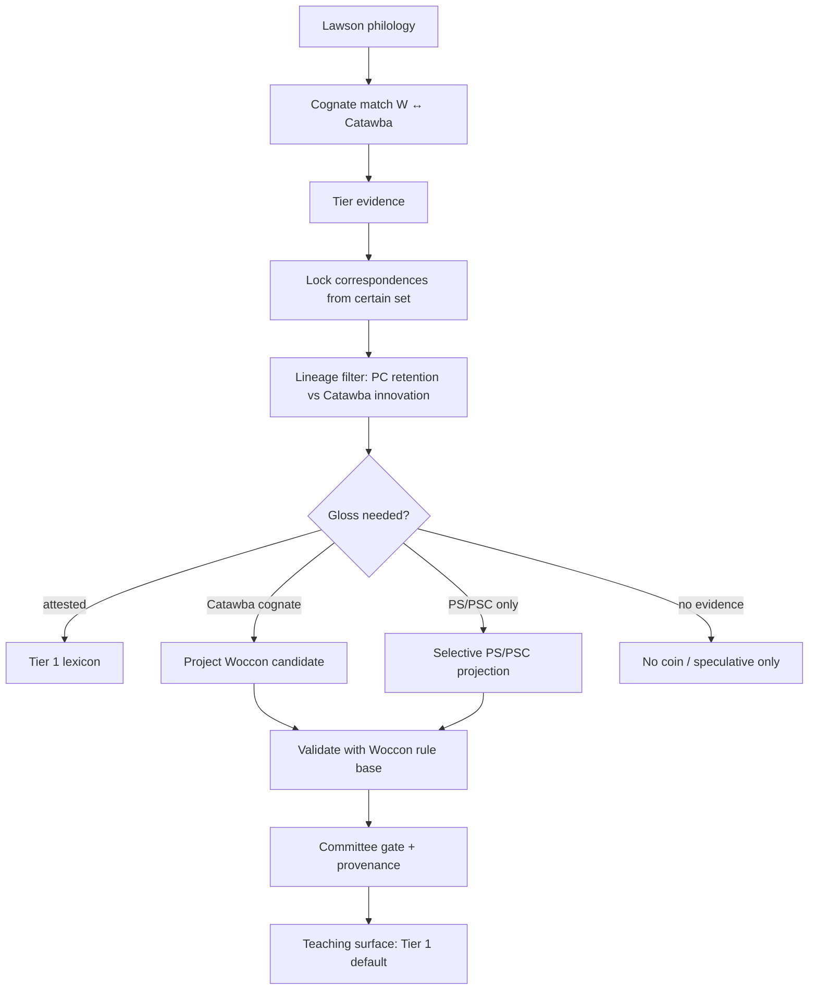

# Woccon Reconstruction Methodology

Scholarly method and operational next steps for expanding past Lawson’s ~143-word list.  
Companion to the engineering roadmap: [RECONSTRUCTION_ROADMAP.md](RECONSTRUCTION_ROADMAP.md).

**Sources distilled here:** Carter (1980); Rudes (1985, 2000); Rankin / CSD; Ko (2023) literature review + NAA finding aids; committee materials in Drive staging; internal discussion (Aug 2026).

---

## Family tree (nodes we care about)

```text
PSC  Proto-Siouan-Catawban     ← deep ancestor of both branches
 ├─ Proto-Siouan               ← Crow, Lakota, Tutelo, Biloxi, …
 └─ Proto-Catawban (PC)        ← ancestor of Catawba + Woccon
     ├─ Catawba                ← large (but uneven) documentation
     └─ Woccon                 ← ~143 words (Lawson 1709)
```

- Woccon is **Catawba’s sister**, not its descendant.
- Rankin’s commonly cited tree often labels only `Catawban → Catawba*` (Woccon may be omitted as a leaf even when named in prose).
- There is **no finished, published Proto-Catawban lexicon** comparable to the Comparative Siouan Dictionary. Rudes (2000) is the closest applied reconstitution for Woccon.

---

## What Rudes actually did (2000)

Everyday engine = **Lawson ↔ Catawba**, not “derive everything from PSC.”

1. **Philology** — Prefer Lawson 1709 spellings (with Carter); correct copyist/printer errors; treat Lawson as explorer orthography (nasals poorly recorded).
2. **Cognate matching** — Align Woccon forms to Catawba (enriched by Siebert / McDavid notes unavailable to Carter).
3. **Evidence tiers** (his appendices) — certain / partial / possible / PS-only (no Catawba) / loan / unknown.
4. **Reconstitute** phoneme inventory + scrapable morphology from the **certain** set.
5. **Lineage filter** — Internal reconstruction + Esaw/Saraw dialect evidence: which Catawba features are **late innovations** (*b/d*, loss of initial *r*, syncope) and must **not** be projected into Woccon.
6. **PS backup** — When Catawba lacks a cognate but Proto-Siouan has one, treat Woccon as ancestral retention (Appendix 4).

**Proto-Catawban** in this workflow is often **implicit**: shared Catawba+Woccon inheritance minus late Catawba-only changes—not a separately published PC grammar.

**Carter (1980)** stopped earlier: consonant correspondences + cognate-density **classification**. Rudes reused that foundation and pushed into full phonology/morphology reconstitution.

---

## Operational pipeline (how we expand past 143)

```text
Want a Woccon form for gloss G?

1. Attested in Lawson (cleaned)?     → use it                    (Tier 1)
2. Else usable Catawba cognate?      → project via W↔C rules     (Tier 2)
3. Else PS/PSC cognate + real rule?  → project cautiously        (Tier 2/3)
4. Else                              → do not auto-coin
                                       (or mark speculative Tier 3)
```



### Where each ancestor fits

| Job | Best input | Notes |
|-----|------------|--------|
| Normalize / teach the 143 | Lawson + Catawba | Rudes/Carter core |
| Coin new words when Catawba has the gloss | **Catawba → Woccon** via W↔C correspondences | **Main expansion path** |
| Block copying Catawba innovations | PC / Catawba-internal evidence | Filter, not generator |
| Gaps with no Catawba cognate; deep prefixes | **PS / PSC** | Backup + morphology (e.g. instrumentals like *ru-*) |
| Full Siouan–Yuchi deep genetics | Out of scope for lexicon expansion | Kasak-style work; not a prerequisite |

**PSC is step 3, not the default crank.** Starting every coinage from PSC without Woccon-specific diachronic rules yields **Catawba-shaped** output (same trap entered through a different door).

---

## Three kinds of “rules” (do not conflate)

In rewrite notation `A → B`, **A** is the **LHS** (left-hand side / input), **B** the RHS (output).

| Kind | LHS looks like | Safe use |
|------|----------------|----------|
| **Orthographic / reconstitution** | Lawson graphemes (`⟨auh⟩`, elongated s, copyist fixes) | Lawson spelling → phonemic Woccon only |
| **Sister correspondences** | Woccon ↔ Catawba segments (e.g. W *r* ↔ C *n/y/d*) | Catawba → putative Woccon (and reverse checks) |
| **True diachrony** | Proto phonemes (`PSC *mn`, `*wi-`) | PSC/PS → Woccon **only where attested with coverage** |

Current `rules_unified.json` and extracted grammar notes are a **mix** of all three. Before any auto-coiner ships, rules must be **split and tagged** by kind, with coverage/status (`established` / `tentative` / `singleton`).

**Holdout test (required before trusting projection):** train correspondences on ~113 Lawson items with known cognates; score on ~30 held-out attested forms. Report accuracy and per-rule diagnostics (rule vs coincidence).

---

## What we already have vs what we need

### Already in-repo (use it)

- Lawson / unified lexicon and panel pending→canonical workflow
- Deterministic Woccon morphology & phonology notes (`rules_unified`, pending rules) — **validators and Woccon-side constraints**
- Seed `sound_correspondences` (letter pairs; need environments + examples)
- Grammar lineage tags on extraction (`woccon_attested`, `proto_catawban`, `siouan_comparative`, …)
- Rudes/Carter text in Drive staging + OCR cache
- **Phase 1 cognate seed:** `woccon_language/cognate_sets/rudes_carter_seed.json` (81 sets, App. 1–4)
- **Phase 2 correspondence registry:** `woccon_language/correspondences/registry.json` (tagged rule kinds + status)

### Missing fuel (priority order)

1. ~~**Structured cognate sets**~~ — **Phase 1 done** (see below). Rudes App. 1–4 as versioned JSON; Carter crosswalk deferred.
2. **Catawba working lexicon** — form + gloss + source + dialect (Esaw/Saraw when known). Breadth first; morpheme breaks next.
3. ~~**Rule-kind tags**~~ — **Phase 2 done** (see below). Orthographic / sister W↔C / diachronic split with `correspondence_status`.
4. **Correspondence registry v2** — richer environments, alignment helper, holdout metrics (Phase 3).
5. **Selective PS/PSC** — CSD ([csd.clld.org](https://csd.clld.org)) for orphan glosses and prefix morphology; not a full family rebuild.
6. **Committee tier policy** — what may enter lessons vs reference-only.

### High-value external archives (Ko 2023 finding aids)

Not required to start coding tables, but best Catawba depth:

- **Blair Rudes Papers (NAA.2009-16)** — Catawba–English dictionary drafts (2003; 2005–06); *Catawba Grammar and Texts* drafts; McDavid notebook copies; Woccon–Catawba correspondence.
- **Robert Rankin Papers (NAA.2014-16)**; APS Siouan-Catawban materials (Ko Appendix C).

---

## Data shapes (roadmap R0 / R1)

Plain-language: two first-class tables (panel DB or versioned JSON), linked to existing `canonical_lexicon` / `canonical_rules`.

### Cognate set (one meaning / etymon)

| Field | Purpose |
|-------|---------|
| `id` | Stable ID |
| `gloss` | English meaning |
| `lawson_form` | Attested spelling (nullable if gap-fill) |
| `woccon_reconstituted` | Rudes-style phonemic form (nullable) |
| `catawba_form` | Comparator (nullable) |
| `catawba_dialect` | `esaw` / `saraw` / `unknown` / null |
| `proto_siouan` / `psc_form` | Optional deep form |
| `evidence_tier` | `certain` \| `partial` \| `possible` \| `ps_only` \| `loan` \| `unknown` |
| `citation_*` / `source_excerpt` | Provenance |
| `notes` | Innovations, copyist fixes, caveats |

### Correspondence (reusable sound/morph rule)

| Field | Purpose |
|-------|---------|
| `id` | Stable ID |
| `rule_kind` | `orthographic` \| `sister_wc` \| `diachronic_psc` \| `diachronic_ps` |
| `lhs` / `rhs` | Input → output segments or graphemes |
| `environment` | e.g. word-initial; before oral V |
| `direction` | `w_to_c` \| `c_to_w` \| `psc_to_w` \| … |
| `status` | `established` \| `tentative` \| `singleton` |
| `example_cognate_ids` | Links into cognate sets |
| `source` | Rudes/Carter/… citation |

Projection engine (roadmap R3) reads **only** `sister_wc` / diachronic rows with `established`/`tentative` status; orthographic rows never apply to PSC input.

---

## Teaching / publication tiers

| Tier | Meaning | Default learner use |
|------|---------|---------------------|
| **1** | Attested Woccon (Lawson + confirmed community) | Default drills |
| **2** | Strong Catawba (+ correspondence) projection; optional PS backing | Intermediate / labeled |
| **3** | Speculative / typology-only / low coverage | Reference only |

Map to `grammar_tier` + `pattern_origin` as in [RECONSTRUCTION_ROADMAP.md](RECONSTRUCTION_ROADMAP.md).

---

## Phase 1 complete: Rudes cognate seed (Aug 2026)

Structured evidence table from Rudes (2000) Appendices 1–4 — **no Qwen reingest required** (built from existing OCR cache).

| Artifact | Path |
|----------|------|
| JSON Schema | [`woccon_language/cognate_sets/schema.json`](../woccon_language/cognate_sets/schema.json) |
| Seed data (81 sets) | [`woccon_language/cognate_sets/rudes_carter_seed.json`](../woccon_language/cognate_sets/rudes_carter_seed.json) |
| Raw appendix slices | [`woccon_language/cognate_sets/_raw/`](../woccon_language/cognate_sets/_raw/) |

**Counts:** App. 1 certain ×58 · App. 2 partial ×7 · App. 3 possible ×6 · App. 4 ps_only ×10.  
`carter_set_ids` is empty in this phase; the Carter crosswalk landed later — see
[Carter (1980) recovery](#carter-1980-recovery-a-silent-ocr-failure-not-a-missing-source).

**Regenerate:**

```bash
python3 scripts/extract_rudes_appendices.py
python3 scripts/build_rudes_cognate_seed.py      # regex parser (default)
python3 scripts/build_rudes_cognate_seed.py --use-llm   # optional LLM pass
python3 scripts/validate_cognate_seed.py
```

Hand-edited fixes can be merged with `--from-json path/to/patch.json`.

**Human spot-check (App. 1 sample, verified against OCR):**

| Item | Gloss | Lawson | Woccon | Catawba |
|------|-------|--------|--------|---------|
| 4 | bottle | Wattape | wátapi | wátapi |
| 6 | bread | Ikettau | iktá·? | iktare |
| 9 | corn | Cose | kus | kus |
| 11 | dog | Tauh-he → Taus-se | tá si | tási |
| 31 | nine | Weihere → Wechere | wa?čare·· | wáča |
| 41 | ronoak | Rummaer → Rummaen | rú?ma? | nú?mą? (Esaw) |
| 52 | three | Nam-mee | ná mi | ná-mina |
| 55 | water | Ejau | yéhiya | yehiye (Saraw) |
| App. 4 #1 | bear | Ourka → Ounka | húka | — (PS *wihú'te) |

Known OCR/parser limitations: morpheme-only rows (Eat #12, Give #19), compound/multi-token Catawba glosses, and a few reconstituted forms with uncertain vowel marks. Re-run validator after hand edits.

---

## Phase 2 complete: Rule kind tagging (Aug 2026)

Tagged correspondence registry from legacy letter pairs, Rudes grammar notes, and Phase 1 cognate examples — **no Qwen reingest required**.

| Artifact | Path |
|----------|------|
| JSON Schema | [`woccon_language/correspondences/schema.json`](../woccon_language/correspondences/schema.json) |
| Registry (73 rules) | [`woccon_language/correspondences/registry.json`](../woccon_language/correspondences/registry.json) |

**Counts:** sister_wc ×52 · diachronic_ps ×17 · orthographic ×4.  
Status: established ×17 · tentative ×20 · singleton ×36.  
15 sister rules linked to Phase 1 cognate IDs (identity pairs like k→k have broad support).

**Regenerate:**

```bash
python3 scripts/tag_rule_kinds.py
python3 scripts/validate_rule_kinds.py
# Optional: backfill panel DB (requires panel deps + DATABASE_URL)
python3 scripts/tag_rule_kinds.py --backfill-panel
```

Hand-edited fixes merge via `--from-json path/to/patch.json`.

**Human spot-check (key rules):**

| Rule | Kind | Status | Notes |
|------|------|--------|-------|
| k→k (legacy) | sister_wc | established | 15 App. 1 cognate examples |
| r→n medial (ronoak) | sister_wc | established | #41, #28 |
| nasal↔oral vowel | sister_wc | established | Rudes phonology prose |
| Lawson no b/d | orthographic | established | Do not project Catawba innovations |
| Bear (App. 4 #1) | diachronic_ps | tentative | PS *wihú'te, not sister_wc |

Panel DB: `rule_kind` and `correspondence_status` columns on `pending_rules` / `canonical_rules`; export via `language_snapshot` includes tags on grammar notes.

---

## Phase 3 complete: Correspondence registry v2 + alignments (Aug 2026)

Environment-aware sister rules and positional alignments for App. 1 certain cognates — still JSON/script-first, no Qwen reingest.

| Artifact | Path |
|----------|------|
| Registry v2 (73 rules) | [`woccon_language/correspondences/registry.json`](../woccon_language/correspondences/registry.json) |
| Alignments sidecar | [`woccon_language/cognate_sets/alignments.json`](../woccon_language/cognate_sets/alignments.json) |
| Gap report | [`woccon_language/correspondences/gaps_report.json`](../woccon_language/correspondences/gaps_report.json) |

**Counts:** 50 App. 1 certain pairs aligned · 40 with rule-backed segments · ≥5 environment-specific established rules with ≥2 aligned examples each.

**Regenerate:**

```bash
python3 scripts/tag_rule_kinds.py
python3 scripts/upgrade_correspondence_registry.py
python3 scripts/align_cognate_pairs.py
python3 scripts/discover_correspondence_gaps.py
python3 scripts/validate_correspondence_registry.py
```

Environments seeded from Rudes prose + curated overrides (`word-initial`, `word-medial`, `vowel_correspondence`, `default`). Alignments stored in a sidecar so the cognate seed JSON stays stable.

---

## Phase 4 complete: Lawson holdout gate (Aug 2026)

Reproducible train/holdout split and deterministic Catawba→Woccon proposer evaluation before bulk coining.

| Artifact | Path |
|----------|------|
| Split (pool=50, holdout=30) | [`data/lawson_holdout_split.json`](../data/lawson_holdout_split.json) |
| Holdout report | [`data/holdout_report.json`](../data/holdout_report.json) |
| Proposer | [`woccon_reconstruction/proposer.py`](../woccon_reconstruction/proposer.py) |

**Headline metrics (v1 proposer):** exact 5 · partial 12 · miss 13 · combined **56.7%** (gate threshold 70% — **documented FAIL**, proceed with caution).

**Regenerate:**

```bash
python3 scripts/build_holdout_split.py
python3 scripts/run_lawson_holdout.py
python3 scripts/validate_holdout_report.py
```

Scoring: primary target `woccon_reconstituted`, Lawson spelling fallback; exact / partial (≥60% prefix) / miss. Gate policy is documented, not auto-blocking. Known misses (dog, water, compounds) should be reviewed with per-rule attribution in the report.

---

## Reconstruction Accuracy Program (Aug 2026)

Follow-on engineering to replace identity-only projection with executable Rudes segment rules, tiered scoring, and anti-bandaids recurrence gate.

### Accuracy correction (Aug 2026)

Three compounding errors were corrected:

1. **Broken cognate pairs** — parser truncated multi-token Catawba (`C nú ne ?` → `nú`); 31% of the pool was structurally unscorable. Fixed extractor + [`corrections.json`](../woccon_language/cognate_sets/corrections.json) + **`broken`** projectability bucket (length-ratio screen).
2. **No copy baseline** — copying Catawba unchanged scored ~63% segment / ~35% whole-word; the pipeline matched that exactly while reporting inflated dev headlines on n=5. All metrics now include **`baseline_segment_accuracy`** and **`value_added_segment`** on the identical row set.
3. **Firing-count gate** — rules that fired but never helped passed recurrence. Replaced with **ablation gate**: non-identity rules must lower train simple segment score when removed (`rule_ablation` table in every report).

| Artifact | Path |
|----------|------|
| Orthography repair | [`woccon_reconstruction/orthography.py`](../woccon_reconstruction/orthography.py) |
| Segment rules | [`woccon_language/correspondences/rudes_segment_rules.json`](../woccon_language/correspondences/rudes_segment_rules.json) |
| OCR corrections | [`woccon_language/cognate_sets/corrections.json`](../woccon_language/cognate_sets/corrections.json) |
| Dictionary cross-check | [`scripts/verify_cognate_seed.py`](../scripts/verify_cognate_seed.py) |
| Projectability buckets | [`woccon_reconstruction/projectability.py`](../woccon_reconstruction/projectability.py) — includes `broken` |
| Tiered scoring + baseline + ablation | [`woccon_reconstruction/scoring.py`](../woccon_reconstruction/scoring.py) |
| Recurrence + ablation gate | [`woccon_reconstruction/recurrence.py`](../woccon_reconstruction/recurrence.py) |
| Morphology track | [`woccon_reconstruction/morphology.py`](../woccon_reconstruction/morphology.py) |

**Regenerate pipeline:**

```bash
python3 scripts/build_rudes_cognate_seed.py          # applies corrections.json
python3 scripts/parse_carter_sets.py --write       # re-adds carter_set_ids (seed rebuild clears them)
python3 scripts/verify_cognate_seed.py             # Lawson vs dictionary.json
python3 scripts/merge_segment_rules.py             # merge into registry.json
python3 scripts/build_holdout_split.py             # train / dev / test + checksum
python3 scripts/run_lawson_holdout.py --eval-split dev
python3 scripts/run_lawson_holdout.py --eval-split test --final   # locked test only
python3 scripts/validate_holdout_report.py
python3 scripts/import_cognates_to_panel.py
python3 scripts/import_correspondences_to_panel.py
```

**Gate policy (v3):** headline metric is **`value_added_segment`** over the copy baseline. Buckets with **<15** items carry `small_sample_warning` and must not be used as headline numbers. Compounds, reduplication, fragments, corrupt OCR, **affixed** (Woccon-only suffix), and **broken** pairs are scored separately in `metrics_by_bucket`. Rules must fire on **≥1 training item** *and* pass **ablation** — removal must lower the train segment score across all projectable buckets. The firing-count precondition was lowered from 2 to 1 because on ~30 training items it rejected genuine Rudes laws (`b→p`, `rd→d`); ablation is the real filter.

**Every report also carries:**
- `rows_changed_by_rules` — if 0, a flat value-added means *no applicable environment in this split*, not rule failure
- `discriminative_*` — metrics restricted to rows where copying is not already perfect
- `rule_ablation` — per-rule delta and verdict (`earns_it` / `neutral` / `harmful`)

**Headline metrics (after correction, pool=61, environment-stratified split):**

| Split | n | Segment | Copy baseline | Value added | Discriminative VA | Whole exact |
|-------|---|---------|---------------|-------------|-------------------|-------------|
| Train | 34 | 69.8% | 68.6% | +1.2% | +1.8% (n=11) | 47.4% |
| Dev | 12 ⚠ | 77.6% | 76.1% | **+1.5%** | **+2.3%** (n=7) | 41.7% |
| Test (locked) | 15 ⚠ | 59.6% | 59.6% | 0.0% | 0.0% (n=11) | 26.7% |

⚠ = below the 15-item headline threshold.

### The binding constraint is carrier scarcity, not rule quality

Each sound law needs training examples to be learned *and* held-out examples to be validated. Census of Appendix 1:

| Environment | Carriers in corpus | Status |
|-------------|--------------------|--------|
| `initial_d` | 5 | learnable + testable |
| `initial_n` | 5 | learnable + testable |
| `final_e` | 7 | learnable + testable |
| `has_b` | 2 | learn **or** test, not both |
| `rd_cluster` | 1 | learn **or** test, not both |

With one carrier, `rd → d` (*wirdyu* → *widyu*) is a documented Rudes law that can never be both trained and validated on this corpus. [`build_holdout_split.py`](../scripts/build_holdout_split.py) now stratifies by rule environment (`--no-stratify-environments` to disable) so dev/test contain applicable cases; before this, every carrier landed in train and dev/test could not measure any rule at all.

**95% whole-word exact is not achievable** on ~58 certain cognates. Segment value-added over the copy baseline is the honest progress measure, and materially raising it requires more cognates, not more rules.

### Rules demoted for linguistic reasons

`rudes_c_zero_to_w_r_initial` was reclassified `morphological_wc` and removed from the phonological proposer. Rudes describes `ru-` as a pronominal stem used with manufactured items (hoe *ruípa*, gunpowder *ruhiyu*, king *rumíra?*), not a sound law. As a phonological rule it fired on every vowel-initial form and wrongly produced *rá·hą?* for goose *á·hą?*. It passed the train ablation gate and still hurt dev — a reminder that ablation on train alone cannot catch a rule that is conceptually wrong.

`rudes_c_d_to_w_n_initial` is conditioned `word-initial-long` (len ≥ 5), applying to *dábusa-* / *dapiné* but not to retained *dápa*.

**Vocabulary vs OCR:** [`dictionary.json`](../woccon_language/dictionary.json) (141 Lawson words) is clean and unchanged. Corruption is confined to the scanned Rudes appendix phonetic notation (`ą`, `·`, `?`); dictionary cross-check auto-verifies 37/58 Appendix-1 Lawson spellings.

### Accuracy ceiling scrutiny (Aug 2026)

Further investigation confirmed **rule-based tuning is exhausted** on the current corpus; growth is required for statistical confidence, not for discovering hidden rules.

**Oracle ceiling** (every sister rule fired, no ablation gate):

| Split | Segment | Copy baseline | Value added |
|-------|---------|---------------|-------------|
| Train | 62.6% | 63.9% | **-1.3%** |
| Dev | 86.5% | 82.7% | **+3.8%** |
| Test | 66.0% | 64.9% | **+1.0%** |

Unconstrained rules **hurt train**; the gated pipeline (+1.1% train, +1.5% dev after Phase A fixes) is doing the right thing by rejecting them.

**Phase A correctness fixes (not accuracy work):**

1. **`trim_final_syllable`** — fixed silent no-op on `wydka ?`; now drops trailing morpheme syllable when Rudes notes say so ([`morphology.py`](../woccon_reconstruction/morphology.py)).
2. **Compound conflation** — Rudes orthographic spacing (`tá si`, `kú wate·`) no longer misroutes to compound when `is_plausible_pair` is true ([`projectability.py`](../woccon_reconstruction/projectability.py)).
3. **Gloss leak** — Appendix 3 entries without `*` no longer grab English gloss words as reconstructions (`húkut` no longer pairs with `ago`).

**Headline metrics (after Phase A, pool=63):**

| Split | n | Segment | Baseline | Value added | Whole exact |
|-------|---|---------|----------|-------------|-------------|
| Train | 34 | 75.3% | 74.2% | +1.1% | 52.6% |
| Dev | 13 ⚠ | 78.3% | 76.8% | +1.5% | 46.2% |
| Test | 16 ⚠ | 64.1% | 64.1% | 0.0% | 31.2% |

Reclassifying mis-bucketed rows changes segment **percentages** but not value-added — that was metric gaming and is explicitly avoided.

**Corpus growth inventory** ([`data/carter_inventory.json`](../data/carter_inventory.json)):

- **Carter sets:** recovered Aug 2026 — 34 sets parsed, 26 linked to seed rows, 8 Carter-only. See below.
- **Appendix 2 re-parse:** recovered Catawba on 5/7 partial cognates (`ww`, `saki`, `pis`, `itus`); items 6–7 have no Catawba in Rudes source.
- **Appendix 3:** 6 entries have Catawba but no starred Woccon — usable only if Lawson spelling is accepted as target (different task).
- **Appendix 4:** 10 entries are Catawban-not-in-Catawba by definition — no C side.

### Carter (1980) recovery: a silent OCR failure, not a missing source

`carter_set_ids` was empty on all 81 rows because the ingest pipeline had been reading a
**diacritic-stripped text layer**. Carter is a 13-page scanned JSTOR PDF
(`data/ingest_sources/1709qKAV…pdf`, cached four times). Its embedded OCR layer carries
~2,700 characters per page of clean English while containing **zero** phonetic characters —
every Catawba form had been flattened to ASCII (`C tauhhe dog` for `C təsi dog`). Rudes 2000
arrived as a hand-typed Google Doc, which is the only reason it parsed correctly.

The detector in [`panel_api/services/pdf_text.py`](../panel_api/services/pdf_text.py) routed
pages to vision OCR purely on character count, so these pages scored as good text. Now
`pages_with_lossy_text_layer()` also flags **image-backed pages whose text layer contains no
phonetic characters**; requiring a full-page image keeps born-digital English documents from
being re-OCRed unnecessarily. Across `data/ingest_sources/`, 48 pages in 5 documents are
flagged; born-digital sources such as the Kasak chapter are correctly skipped.

Re-OCR via `scripts/reocr_lossy_pdf.py` (Qwen3.6-27B vision, 300 DPI) recovered 196 phonetic
characters document-wide. Fidelity was confirmed against Rudes as an independent witness: the
two sources agree on `kus`, `yap`, `wą`, `yači`/`yá-če`, `waʔ`/`wa?`, `aha`/`á·ha`, and the
parse yields exactly the **34** sets Carter's own prose claims ("thirty-four of the 143 items").

**What it did and did not buy.** `scripts/parse_carter_sets.py` links 26 sets to seed rows,
populating `carter_set_ids` and `carter_catawba_forms` (an independent second reading of the
Catawba side). Two links expose genuine scholarly disagreement over Lawson's orthography —
Carter's `Tauh-he` dog vs Rudes' `Taus-se`, Carter's `Yuncor` wind vs Rudes' `Yuh-hor`.
Of the 8 Carter-only sets, exactly **one** (`carter1980_set_16`, `yamusi` old woman) supplies a
Catawba source for a seed row that has a reconstruction target but lacked one
(`rudes2000_app4_006`, `yíku`). The other 7 have no starred Woccon target, the same blocker as
Appendix 3. Dev metrics are unchanged (78.3% / +1.5%), as expected from additive metadata.

**Conclusion — the constraint is now measured, not inferred.** Of the 25 seed rows excluded
from evaluation: 7 lack a Woccon reconstruction target, 12 lack a Catawba source form, and 7
are bound morphemes that are legitimately not whole-word projectable. Carter, the most-cited
secondary source available, closes exactly one of those gaps. Reconstruction accuracy is
therefore bounded by the absence of a **Catawba lexicon** — Speck's Catawba texts, Carter's and
Rudes' shared source, appear nowhere in the corpus except as citations.

### The rest of the secondary literature, re-OCRed and exhausted

Every remaining diacritic-stripped source was recovered and checked. Neither adds an
evaluable pool item, which settles the rules-vs-corpus question empirically rather than by
inference from the oracle ceiling.

**Koontz, "Siouan Syncopating \*r-Stems"** (Second Siouan Languages Conference, 1983;
`data/koontz_reocr.json`) — 0 → 320 phonetic characters, 240 Proto-Siouan reconstructions.
It supplies exactly the external comparative support one would want for an *r* rule: Siebert
(1945) shows Catawba `du` is the cognate of PSi `*ru`, and PSi `*/y/` vs `*/r/` stay distinct in
Southeastern Siouan and "perhaps also in Catawba." A Catawba *d* ~ Woccon *r* rule is therefore
well motivated on comparative grounds — and has **no carriers**. The only two pool rows pairing
those segments are `dapiné há·ksa?` → `tu hárksa` (*d* ~ *t*) and `wirdyu` → `widyu` (*r*-deletion).
Such a rule would be rejected by the recurrence and ablation gates on arrival. Koontz's one
Woccon set, `raute` /roti/ 'eat' ~ PSi `*rútA` (Carter 1980:177), is unusable here because, as
Koontz states, no Catawba cognate of `*rútA` has been identified.

**Rudes, "The Universal versus the Particular"** (IJAL 1985; `data/rudes1985_reocr.json`) —
0 → 22 phonetic characters, on Woccon number words. It confirms rather than extends the pool.
Catawba `dâwasa` 'eight' is already present as `dábusa-` on `rudes2000_app1_013` (the *b* ~ *w*
variation is the point of Rudes' own footnote, citing Gallatin's `lubbosa`). For
`rudes2000_app2_006` `Nommis-sau` 'seven', Rudes argues the Catawba word `wasignúre` descends
from PSi `*sakuwĩ` and is **not** cognate with the Woccon form — so that row's empty Catawba
field is a correct result, not a gap to fill.

**Net across all three recovered sources:** one evaluable item (Carter's `yamusi`).

**Next step:** acquire a Catawba lexical source (Speck 1934, Voegelin, Siebert). Both other
levers are now measured as exhausted: phonological rules by the oracle ceiling, and secondary
literature by the re-OCR sweep above.

---

## Phase 5 complete: Panel comparative tables + API (Aug 2026)

Queryable cognate sets and correspondence rules in the control panel DB; JSON seeds remain source of truth for regeneration.

| Artifact | Path |
|----------|------|
| DB models | [`panel_api/db.py`](../panel_api/db.py) — `cognate_sets`, `correspondence_rules`, `cognate_rule_examples` |
| Import service | [`panel_api/services/comparative_import.py`](../panel_api/services/comparative_import.py) |
| API routes | [`panel_api/routes/comparative.py`](../panel_api/routes/comparative.py) |
| Browse UI | [`panel/src/pages/Comparative.tsx`](../panel/src/pages/Comparative.tsx) |

**Import (wholesale replace):**

```bash
# Requires panel deps + DATABASE_URL
python3 scripts/import_correspondences_to_panel.py
python3 scripts/import_cognates_to_panel.py
# Or via admin API:
# POST /api/admin/import-comparative
```

Lexicon linking: normalize Lawson / reconstituted form → `canonical_lexicon.woccon_normalized`; gloss fallback. Panel UI is read-only v1 — edits via JSON + re-import.

---

## Next steps (ordered)

### Near-term (methodology readiness)

1. ~~**Import Rudes/Carter cognate sets**~~ — **Done (Phase 1):** [`rudes_carter_seed.json`](../woccon_language/cognate_sets/rudes_carter_seed.json).
2. ~~**Tag existing rules**~~ — **Done (Phase 2):** [`correspondences/registry.json`](../woccon_language/correspondences/registry.json).
3. ~~**Upgrade correspondence registry**~~ — **Done (Phase 3):** environments + alignments + gap report.
4. ~~**Run Lawson holdout evaluation**~~ — **Done (Phase 4):** 56.7% combined (below 70% gate); review failures before bulk coining.
5. ~~**Stand up cognate_set + correspondence tables**~~ — **Done (Phase 5):** panel DB + API + Comparative browse page.

### Medium-term (fuel + projection)

6. **Ingest a Catawba working lexicon** (Shea / Rudes drafts / Speck / committee-approved lists) with dialect tags; link to cognate sets.
7. **Deterministic Catawba→Woccon proposer** using only tagged sister rules + Woccon phoneme/morphology validators; write `reconstruction_candidates` with explanation + rule IDs.
8. **Selective CSD/PSC path** for orphan glosses and prefixes; never as silent fallback for all glosses.
9. **Committee policy** on Tier 2 in lessons; wire assistant/lessons to refuse unlabeled coinages.

### Parallel archive work (optional but high leverage)

10. Pursue **Rudes NAA dictionary + grammar drafts** (and APS/Siebert as needed) for Catawba depth Ko documented.

### Explicitly defer

- Full Proto-Catawban or Siouan–Yuchi reconstruction as a prerequisite.
- Unsupervised correspondence discovery without a human pending queue.
- Training ByT5 / LLM coinage on unreviewed staging as if attested.
- Applying orthographic Lawson rules to PSC forms.

---

## Open decisions

1. Official orthography for Tier 1 display: Lawson spelling vs reconstituted phonetic?
2. Tier 2 in classrooms: disclaimer vs reference-only?
3. Rules-first proposer vs ML-assisted ranking (ML never sole authority)?
4. Which candidate rows may be public vs panel-only?

---

*Recorded: 2026-08-01. Phase 1 cognate seed shipped 2026-08-01. Phase 2 rule-kind registry shipped 2026-08-01. Phase 3 registry v2 + alignments shipped 2026-08-02. Phase 4 holdout report shipped 2026-08-02. Phase 5 panel comparative DB shipped 2026-08-02.*
