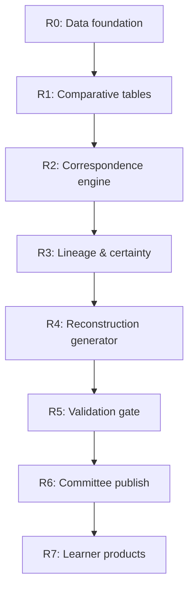
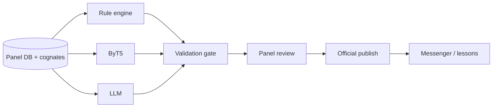

# Woccon Reconstruction Roadmap

This document maps the **long-term reconstruction vision** (comparative database → scored candidates → community-gated teaching materials) to what exists in the repo today and what to build next.

**Scholarly method & next steps:** [RECONSTRUCTION_METHODOLOGY.md](RECONSTRUCTION_METHODOLOGY.md) — Rudes/Carter pipeline, Catawba vs PSC roles, rule kinds, cognate/correspondence shapes, ordered next steps.

Related docs: [CONTROL_PANEL.md](CONTROL_PANEL.md), [PLAN.md](../PLAN.md) (ingest/panel history), [CLAUDE.md](../CLAUDE.md).

---

## North star

The system should be **less like “ChatGPT for Woccon”** and more like:

> **Structured comparative database + reconstruction engine + confidence scoring + explanation layer + community review interface**

Learners and committee members interact with **approved, cited** material; speculative reconstructions stay labeled and quarantined until reviewed.

---

## Where we are now (snapshot)

| Area | Status | Primary code / data |
|------|--------|---------------------|
| Source digitization & extraction | **Strong** | `panel_api` ingest, Drive staging, `merge_staging.py` |
| Human review & canonical DB | **Strong** | `panel/`, `panel_api/routes/pending.py`, Postgres/SQLite |
| Rule-based morphology | **Partial** | `main.py` (`WocconT5`), `woccon_morphological_analyzer.py` |
| Static sound correspondences | **Partial** | `dictionary.json`, `rules.json` tables |
| ByT5 reconstruction model | **Scaffold** | Model loaded; fine-tuning optional, not production |
| LLM tutor / Messenger | **Live** | `woccon_llama_integration.py`, lessons |
| Automated comparative engine | **Not started** | — |
| Committee “official” publish gate | **Not started** | Admin commit only |
| Learner app / phrasebook products | **Not started** | Lessons in chat only |

**Runtime source of truth:** `WOCCON_LANGUAGE_SOURCE=panel_db` (default) — assistant reads canonical rows from the panel DB; unified JSON on disk is a **backup export** on Commit.

---

## Pipeline roadmap (7 steps)

Each step has a **definition of done (DoD)** and suggested **phases** (R0–R6). Dependencies flow downward; later steps should not ship without provenance from earlier ones.

### Step 1 — Digitize and normalize sources

**Today (~65%):** Lawson core, Drive/upload extraction, pending → canonical workflow, citations, base vocabulary (~209 words), unified JSON export.

| Phase | Work | DoD |
|-------|------|-----|
| **R0-a** ✅ | Panel upload, library, provenance, commit | Scholars can upload PDF/Drive; every canonical row has `source_url`, page, excerpt |
| **R0-b** | Comparative lexicon schema | New DB tables or JSON schema: `cognate_sets` with columns for Woccon, Catawba, Proto-Siouan, gloss, source_id |
| **R0-c** | Import pipelines | Script/API to import existing cognates from `rules_unified` / Carter papers into cognate sets (semi-automated) |
| **R0-d** | Normalization | Consistent orthography fields (Lawson vs modern phonetic), `language_tag` per form |

**Exit criteria:** Query API returns cognate sets for a gloss or Woccon form; not only prose in grammar notes.

---

### Step 2 — Identify sound correspondences

**Today (~25%):** Hand-curated `sound_correspondences` in dictionary/rules; substring lookup in `analyze_word()`; `woccon_evaluator.py` prompt tests on base ByT5.

| Phase | Work | DoD |
|-------|------|-----|
| **R1-a** | Correspondence registry | Versioned table: Woccon segment → Catawba segment(s), environment, examples[], source, status (`established` / `tentative`) |
| **R1-b** | Alignment helper | Given a cognate set, suggest segment alignments (rule-based + optional LLM); human confirms in panel |
| **R1-c** | Discovery assist | Flag pairs in cognate DB that match known patterns but lack registry entry |
| **R1-d** | ByT5 eval loop | Fine-tune or few-shot ByT5 on **confirmed** alignments only; report precision on held-out Lawson+Catawba pairs |

**Exit criteria:** New correspondence hypotheses appear as **pending** rows with evidence links; nothing auto-writes to canonical without review.

---

### Step 3 — Infer Proto-Catawban / Woccon patterns

**Today (~40% data, ~10% automation):** `grammar_lineage` (attested Woccon, proto-Siouan, proto-Catawban, etc.); comparative content in extracted notes — no four-way innovation model.

| Phase | Work | DoD |
|-------|------|-----|
| **R2-a** | Lineage + certainty model | Extend lexicon and rules with `pattern_origin`: `inherited_siouan` \| `proto_catawban` \| `catawban_innovation` \| `woccon_innovation` \| `uncertain` |
| **R2-b** | Map existing tags | Migration: `woccon_attested` → Tier 1; `siouan_comparative` / `proto_*` → Tier 2+ with origin field |
| **R2-c** | Panel filters | Dictionary/Rules UI filters by origin and grammar tier; export includes fields |
| **R2-d** | Grammar tiers (pedagogy) | Explicit **Tier 1** (attested Woccon only) vs **Tier 2** (strongly supported by Catawba + Siouan, not attested in Woccon) labels in UI |

**Exit criteria:** Every committed grammar note and reconstruction lexicon row has `pattern_origin` + `grammar_tier`; lesson generator can exclude Tier 2+ from drills by default.

---

### Step 4 — Generate candidate reconstructions

**Today (~15%):** Suffix-chain `generate_form()` on **known** roots; morph confidence scores; no open-ended “propose Woccon from Catawba.”

| Phase | Work | DoD |
|-------|------|-----|
| **R3-a** | Candidate schema | `reconstruction_candidates` table: proposed_form, gloss, input_cognates[], applied_rules[], confidence, explanation, status |
| **R3-b** | Rule-based proposer | Apply correspondence registry + suffix rules to generate candidates from cognate sets (deterministic) |
| **R3-c** | ByT5 / seq2seq | Train on attested Woccon + aligned Catawba; output only routed through validation (R4) |
| **R3-d** | LLM assist (optional) | Plain-language “explore this candidate” in panel using RAG — clearly labeled speculative |
| **R3-e** | Panel queue | Workers review candidates → approve as pending lexicon or reject |

**Exit criteria:** One documented end-to-end example: Catawba form + cognate set → candidate → validation report → human approval → pending lexicon.

---

### Step 5 — Human linguistic review

**Today (~75%):** Pending lexicon/rules, approve/modify/reject, duplicates, base linking, audit, roles (admin/worker/member).

| Phase | Work | DoD |
|-------|------|-----|
| **R4-a** ✅ | Core review UI | Pending, Dictionary, Rules, Library, Commit |
| **R4-b** | Extraction verification | Post-extract diff report (model vs source) surfaced in Library before bulk approve |
| **R4-c** | Candidate review | Dedicated UI for `reconstruction_candidates` linked to cognate sets |
| **R4-d** | Linguist annotations | Threaded `reviewer_notes`, disagreement flags, “needs committee” tag |

**Exit criteria:** Reviewers never need to edit production JSON by hand; all paths go through panel with audit trail.

---

### Step 6 — Committee approval

**Today (~5%):** Technical `POST /api/admin/commit` only — no tribal council workflow.

| Phase | Work | DoD |
|-------|------|-----|
| **R5-a** | Publication states | `draft` \| `reviewed` \| `committee_approved` \| `official_teaching` on canonical lexicon/rules |
| **R5-b** | Roles | New role e.g. `committee` (or per-item approval by named approvers); separate from `admin` |
| **R5-c** | Approval record | Who approved, when, optional meeting reference; immutable history |
| **R5-d** | Assistant gating | Messenger/lessons use only `official_teaching` (configurable staging mode for workers) |

**Exit criteria:** No learner-facing surface shows unapproved reconstructions; committee sign-off is queryable and auditable.

---

### Step 7 — Publish community-approved outputs

**Today (~45%):** Messenger bot, vocabulary/grammar lessons, dictionary by teaching unit — not a standalone curriculum product.

| Phase | Work | DoD |
|-------|------|-----|
| **R6-a** | Tier-aware lessons | `lesson_manager` / `grammar_lesson_manager` pull only approved Tier 1 (configurable Tier 2) |
| **R6-b** | Pronunciation layer | Merge pronunciation guide onto approved entries; Kokoro CPU batch → MP3 clips served at `/api/pronunciation-audio/` |
| **R6-c** | Export bundles | Generate phrasebook / printable lesson JSON from approved subset |
| **R6-d** | Public dictionary | Read-only `/panel` or static site: official lexicon + “reconstruction” section clearly separated |
| **R6-e** | Tutor guardrails | RAG + validation: assistant cites chunk IDs; refuses to coin new forms without “speculative” label |

**Exit criteria:** Published “Woccon 101” unit uses only committee-approved Tier 1 items; reconstructions visible but labeled.

---

## Model architecture roadmap

Target hybrid stack (not one general LLM):

| Layer | Role | Current | Next milestones |
|-------|------|---------|-----------------|
| **Structured DB** | Cognates, rules, correspondences, citations | Panel DB + JSON exports | R0 cognate schema; R1 correspondence registry |
| **Rule engine** | Morphology, suffix order, phonology checks | `WocconT5.generate_form`, morph analyzer | R3-b deterministic proposer; R4 validation API |
| **ByT5 / byte-level** | G2P-style transforms, alignment, small-data forms | Loaded, not fine-tuned | R1-d eval; R3-c train on approved pairs only |
| **LLM (Llama/Foundry/Claude)** | Extraction, explanations, conversation | Production for ingest + chat | R4-d explore mode; R6-e cite-only tutor |
| **Validation gate** | Block wild outputs | Partial (suffix legality, lesson heuristics) | R4 service: every candidate gets pass/fail + reasons |
| **Explanation layer** | Why this form was suggested | Provenance on commits only | R3 candidate `explanation` + rule IDs used |

---

## Grammar reconstruction tiers

Map vision tiers to implementation fields:

| Teaching tier | Meaning | Implementation target |
|---------------|---------|-------------------------|
| **Tier 1** | Directly attested in Woccon (Lawson + confirmed community) | `grammar_tier=1`, `grammar_lineage=woccon_attested`, `lesson_band=lawson_core` |
| **Tier 2** | Strongly supported by Catawba + broader Siouan; not attested in Woccon | `grammar_tier=2`, `pattern_origin=inherited_siouan` or `proto_catawban`, `lesson_band=intermediate` |
| **Tier 3** | Reconstruction / speculative | `grammar_tier=3`, `pattern_origin=uncertain`, `lesson_band=reference`, excluded from default drills |

Existing `grammar_lineage` values remain for **scholarly** classification; add `grammar_tier` (1–3) for **pedagogy and publication**.

---

## Suggested implementation order

Prioritize **data shape** before **model glamour** — the panel and provenance are the moat.

| Order | Track | Phases | Est. effort |
|-------|-------|--------|-------------|
| 1 | **Foundation** | R0-b,c,d cognate schema + import | Medium |
| 2 | **Review quality** | R4-b extraction verification | Small–medium |
| 3 | **Linguistic typing** | R2-a,b,c lineage + grammar tiers | Medium |
| 4 | **Correspondences** | R1-a,b,c registry + panel UI | Medium |
| 5 | **Candidates** | R3-a,b + R4 validation gate | Large |
| 6 | **Models** | R1-d, R3-c ByT5 (only after registry stable) | Large |
| 7 | **Governance** | R5 committee publish states | Medium |
| 8 | **Products** | R6 tier-aware lessons + exports | Medium |

**Quick wins (1–2 weeks each):**

- Update stale docs: mark control panel Phase 5 **done** in `PLAN.md`.
- Add `grammar_tier` column + panel filter (R2-a light version).
- Extraction verification report on re-extract (R4-b).
- Document `lesson_band=reference` policy in lesson managers (R6-a light).

**Do not start yet (depends on above):**

- Unsupervised “discover all correspondences” without human pending queue.
- Messenger freely coining new Woccon words without validation metadata.
- Training ByT5 on unreviewed staging JSON.

---

## Success metrics

| Metric | Target |
|--------|--------|
| Cognate sets with ≥2 languages | 200+ curated, cited |
| Established correspondences | 50+ with examples |
| Candidates → approved lexicon | Pipeline demo + 10 approved items |
| Tier 1 lesson content | 100% from `official_teaching` + Tier 1 |
| Assistant hallucination | Zero unattested forms presented as attested (automated test on sample prompts) |
| Review latency | Upload → pending available &lt; 30 min for typical PDF |

---

## Completed platform work (keep maintained)

These phases from [PLAN.md](../PLAN.md) are **done** — maintain, don’t replan:

1. Drive ingest & auth  
2. Upload-first + panel extraction (replaces scheduled scrape)  
3. Structured extraction (LLM + merge)  
4. RAG reload + `[Community]` chunk precedence  
5. Control panel (JWT, pending, commit, Postgres, base vocab, grammar taxonomy)  

Ongoing ops: Azure Postgres, `pull_panel_db_from_postgres.sh`, email invites — see [CONTROL_PANEL.md](CONTROL_PANEL.md).

---

## Open decisions

Record choices when the committee or lead linguist decides:

1. **Orthography authority** — Lawson spelling vs phonetic (Shea/Carter) for “official” forms?  
2. **Tier 2 in classrooms** — allowed in lessons with disclaimer, or reference-only?  
3. **ByT5 vs rules-first** — deterministic proposer as source of truth with ML as ranker?  
4. **Public vs private** — which dictionary rows are web-public vs panel-only?  

---

*Last updated: 2026-08-01. Revise when R0–R6 phases ship or priorities change. Linguistic method detail lives in RECONSTRUCTION_METHODOLOGY.md.*
